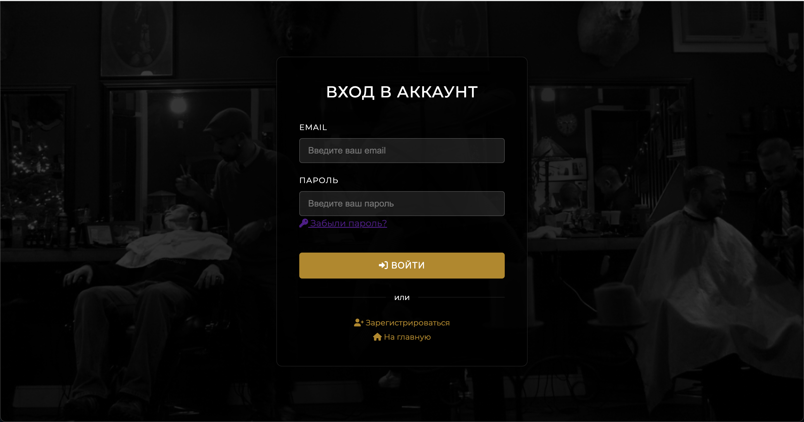
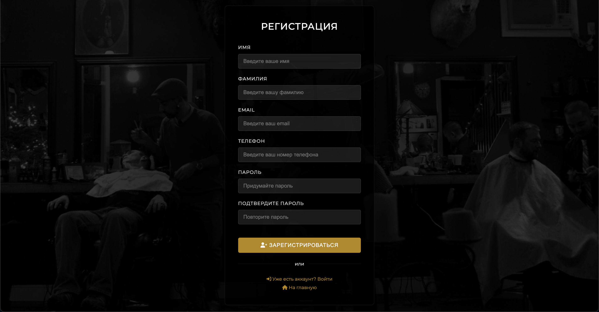
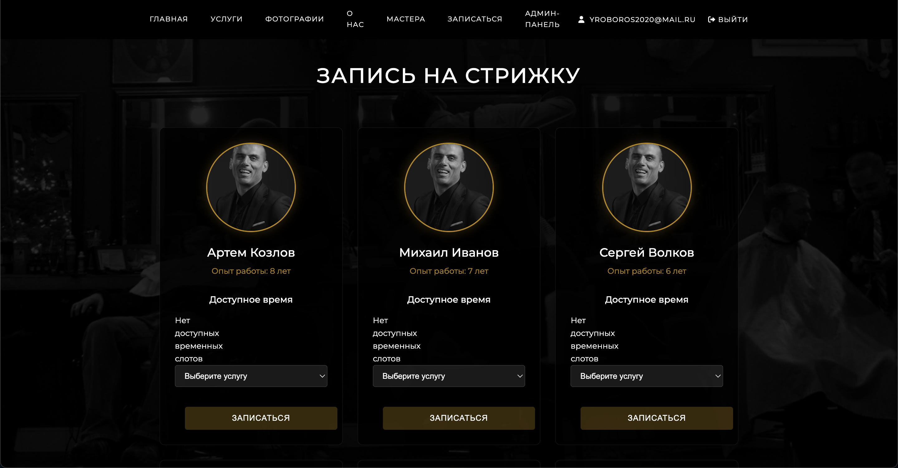
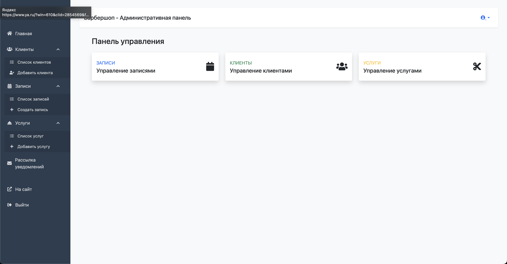

Веб-приложение для управления барбершопом, разработанное на Java с использованием Spring Boot

## 🚀 Технологический стек

- **Backend**: Sring Boot
- **Frontend**: HTML5, CSS3, JavaScript
- **База данных**: JPA, PostgreSQL
- **Сборка**: Maven
- **Шаблонизация**: Thymeleaf

## 🛠 Функционал
- Регистрация и авторизация клиентов, отправка пуш уведомления на телефон клинта о регестрации
- Запись на прием к барберу
- Управление барберами (для администраторов)
- Управление клиентами (для администраторов)
- Просмотр расписания
- История посещений
- Отправка уведомлений клиентам на почту (для администраторов)
- Управление услугами и ценами
- Админ панель для управления заказами, категориями стрижек, временных слотов для оказания услуг

## 📸 Скриншоты

## 🤝 Контакты

Разработчик: Дмитрий Рыбаков
Email: yroboros2020@mail.ru

GitHub: [@https://github.com/RybakovDmitry2072](https://github.com/RybakovDmitry2072)